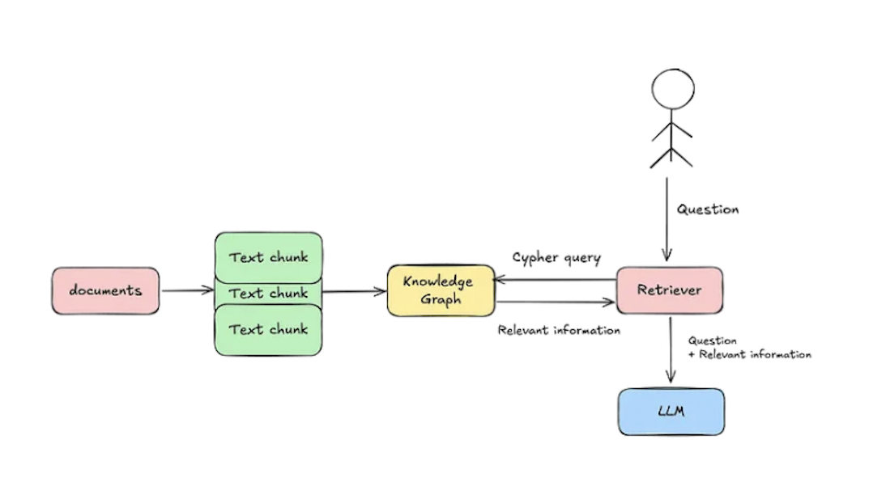

# Legal Assistant System

## Overview

The Legal Assistant System is designed to assist legal professionals in efficiently analyzing legal cases. By uploading a legal document, users can query the system and receive answers based on the content of the case file. The system employs an advanced Retrieval-Augmented Generation (RAG) architecture in the backend, enhancing the accuracy and relevance of the responses provided by the Language Model (LLM).

## Demo
[](https://www.youtube.com/watch?v=I5XRJoJ1XX4)


## Tech Stack

**Client:** Streamlit

**Server:** Fastapi, LlamaIndex, LLM, 
Knowledge Graphs

**Database:** Falkordb


## Project Architecture
```bash
legal_assistant/
├── backend/ 
├── frontend/ 
├── .github/     
│   └── workflows/
├── .pre-commit-config.yaml 
├── docker-compose.yml 

```
**Overview:**


**GraphRAG architecture:**


**Generating Knowledge Graph from Documents**


## Installation

Installation
To run this project, you will need to do the following steps:

Clone the repo

```bash
git clone git@github.com:EASS-HIT-PART-A-2024-CLASS-VI/legal_assistant.git
```
Go to the main folder of the project: cd legal_assistant

Run all containers (frontend, backend, database) with docker-compose

```bash
docker compose up --build 
```

legal_assistant Application is on the air: http://localhost:8501

## Environment Variables
Backend
```bash
FALKORDB_RAG_URI=falkor://:falkordb@graphdb:6379
FALKORDB_HOST=graphdb
FALKORDB_PASSWORD=falkordb
OPENAI_API_KEY=secret_key
```
Frontend
```bash
FASTAPI_URI=http://backend:8000
```

## Test
Unit test are running on the CI but you can run them locally.
```bash
cd backend
pytest tests/unit_tests 
```
For Integration test follow this - 
```bash
cd backend/src/dev_env
docker compose -f docker-compose.dev.yml up
```
New terminal -
```bash
cd backend
pytest tests/integration
```

# Documentation

Further Documentation can be found in the  [docs](docs) folder where you can find:
- [PROJECT.md](docs%2FPROJECT.md) for more information on the project and the file structure

## API Reference

For API documentation, visit the Swagger UI at [http://localhost:8000/docs](http://localhost:8000/docs).